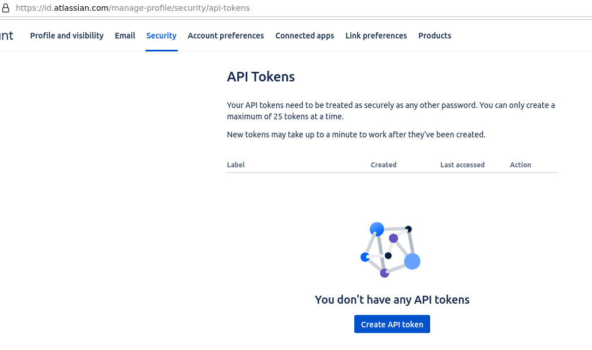
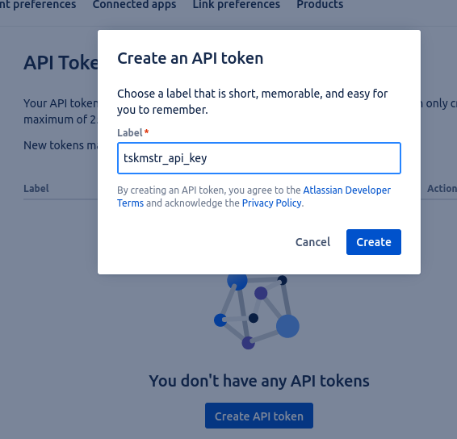
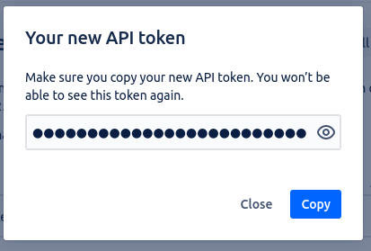
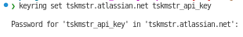

# Configuring Jira

## Create an API key 

1. Login to your Atlassian Jira instance, and `Manage Account`.
   (click on your avatar icon, top right)

   

2. Create a new API Key

   Name it - tskmstr_api_key

   

3. Copy it.

   (Suggest put it in your password manager)

   

4. Add the Key to the OS Keyring 
    ```
    keyring set <your-jira-endpoint-server> tskmstr_api_key
    ```
    e.g.

    